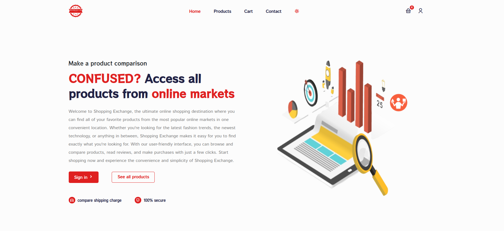

# ShoppingExchange
[](https://github.com/IlyasOsman/)

## Description
Shopping Exchange is a web application that compares prices from different ecommerce websites, making it easy for users to find the best deals on the products they're looking for.

### Technologies Used:

---

 - React.js
 - Redux Toolkit
 - ReactStrap
 - CSS
 - Emailjs
 - Rails
 - SQLite
 - PostgresSQl

## [Live Link](https://shoppingexchange.vercel.app/home)

---
Here is live link for this project : 

https://shoppingexchange.vercel.app/home

 


## MVPs

---

 - User can view a list of Products
 - User can view a specific product
 - User can log in if they have an account
 - User can sign up if they don't have an account

### Features:

---

#### Here's features included in this project

- Add to cart functionality
- Shopping cart functionality
- Product Filtering functionality
- Product page
- Cart and checkout page
- Contact page
- Login and Register page
- Awesome modern minimalist UI

## Setup
---

### Prerequisites

 - Node.js
 - React
 - Ruby
 - PostgreSQL

### Frontend

 - Fork and Clone this repository
 - Run `npm install` to install all the dependencies
 <br />
        ```npm install```
 - Run `npm start` to start the development server <br />
        ```npm start```

### Backend
Link to backend repository : https://github.com/IlyasOsman/product-comparator-api
 - Clone this repository
 - Run `bundle install` to install all the dependencies <br />
        ```bundle install```
 - Run `rails db:migrate db:seed` to create and migrate the database. <br />
        ```rails db:migrate db:seed```
 - Run `rails server` to start the development server. <br />
        ```rails s```

### Backend api 
Here is backend api hosted on heroku.
  -  ```https://enigmatic-wildwood-08782.herokuapp.com/products```
### Endpoints
     ```https://enigmatic-wildwood-08782.herokuapp.com/products```
    ```https://enigmatic-wildwood-08782.herokuapp.com/stores```
## License

This project is licensed under the MIT License 

